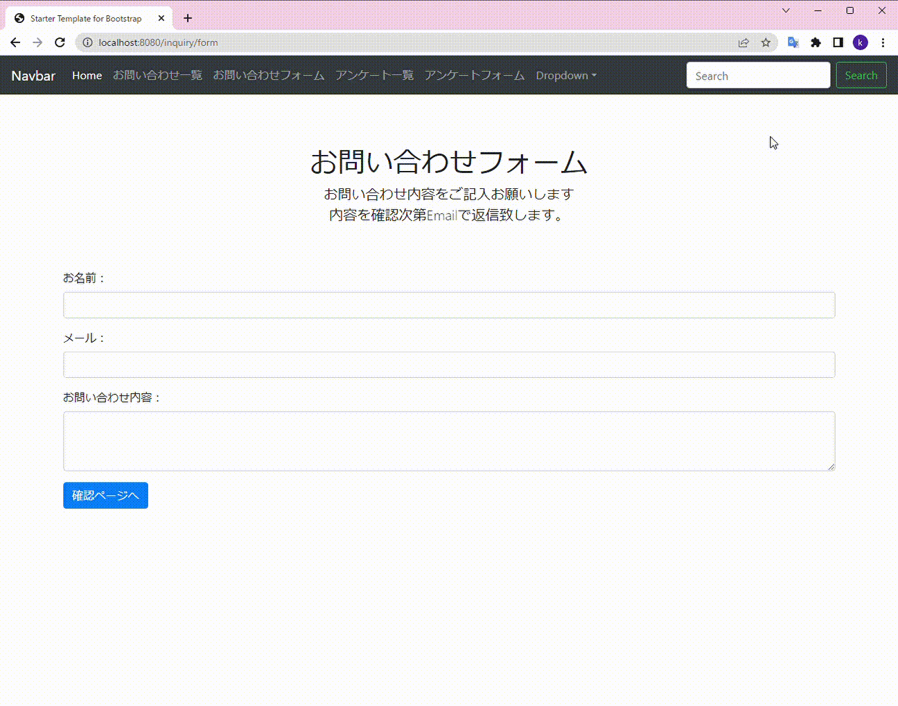

# お問い合わせアプリ（spring）
***

***

## 説明

* 「spring」を利用したお問い合わせアプリ
* データベースに接続し、データの保存、表示が可能

## 主な機能

### 1. お問い合わせフォーム画面
* バリデーションチェック（未入力、メールアドレスの形式、文字制限）
* 入力データを保存用クラスに格納
* 「確認」ボタンを押すと確認画面へ遷移

### 2. 確認画面
* 格納された入力データを取得し、画面に表示
* 「戻る」ボタンを押したら入力した文字が残る
* 「送信」ボタンを押したら「送信されました。」の表示
* 「送信」ボタンを押したらDBに接続しデータを保存
* データ送信時、「リダイレクト」を使用することで二重クリック防止

### 3. お問い合わせ一覧画面
* DBに接続し全件データを取得し、画面に表示

### 3. ヘッダー
* htmlをブロック化しヘッダー部分はどの画面でも表示
* 各種機能へのリンク

